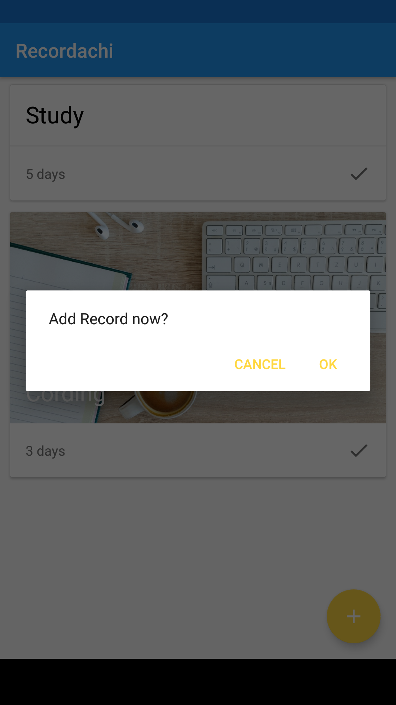

# Recordachi
[](#)
[](#)
[](#)
[](#)
[](#)

## Overview
It is an application to record the date when it performed.

## ScreenShot
| Main | Add event | Add record |
| ---- | --------- | ---------- |
|  |  |  |

## Libraries
This project uses some libraries.

- Android Support Libraries
- Android Data Binding Compiler
- Kotlin Standard Library
- [Android Architecture Components](https://developer.android.com/topic/libraries/architecture/index.html)

## License
```
Copyright 2018 yuzumone

Licensed under the Apache License, Version 2.0 (the "License");
you may not use this file except in compliance with the License.
You may obtain a copy of the License at

    http://www.apache.org/licenses/LICENSE-2.0

Unless required by applicable law or agreed to in writing, software
distributed under the License is distributed on an "AS IS" BASIS,
WITHOUT WARRANTIES OR CONDITIONS OF ANY KIND, either express or implied.
See the License for the specific language governing permissions and
limitations under the License.
```
